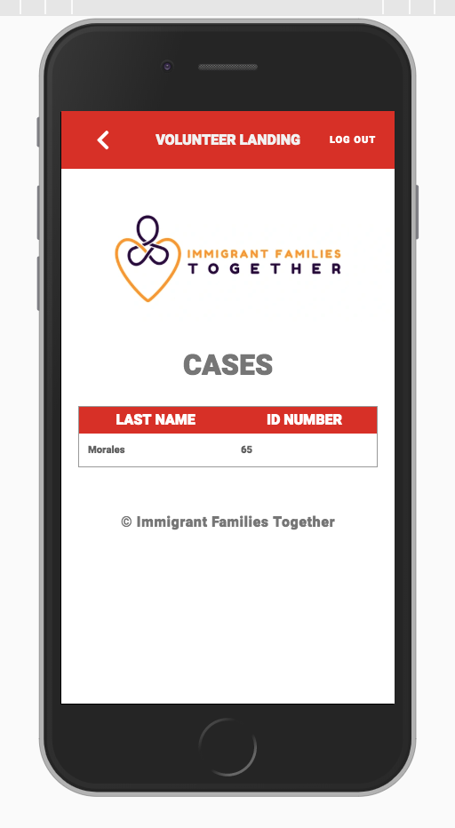
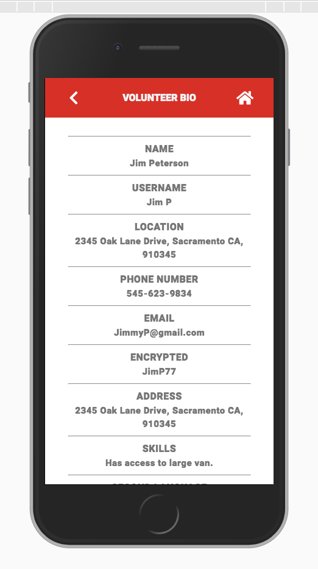

# Immigrant Families Together
Immigrant Families Together is a volunteer-based organization that reunites separated families. The staff is composed entirely of volunteers, many of whom are balancing full-time jobs and families. They currently assist nearly seventy five families in areas ranging from posting bond, finding legal help, and supplying financial assistance.

# Built With 
React, Redux, HTML, CSS, Passport, Axios, Postgres, Node, Express, and more. (package.json file contains full list)

# Getting Started 
Follow along the instructions below to retrieve a copy of this repo into your local machine. 

# Prerequisites
Software that is required prior to starting the application
Node.js

### Installing - Get the Development Environment Running 
1. Download the project
2. type "npm install" into your terminal
3. type "npm start" into your terminal

### Create database 
1. Download and open Postico
2. Create new database named "immigrant_families"
3. Copy and paste SQL text from file
4. Insert SQL text into Postico to CREATE TABLES

### Heroku Prerequisite (one time)

1. Sign up for an account on [Heroku.com](https://www.heroku.com/)
- You may have to give them a credit card, but you shouldnt need to pay for anything
2. Install Heroku CLI by typing `brew install heroku/brew/heroku` in Terminal
3. Authenticate by typing `heroku login` in Terminal

### Heroku Setup

Run the following commands from within your project folder.

1. In terminal, navigate to your project folder and type `heroku create`
2. Login in if prompted -- it might ask to open a browser
3. Type `git remote -v` to ensure it added successfully

Next, commit your changes and push them to Heroku:

```
git add .
git commit -m "MESSAGE"
git push heroku master
```

   > Note: You'll need to commit and push each time you make a change that you want to deploy to Heroku. **Keep in mind you CAN NOT pull from Heroku. This is not a replacement for GitHub!**

Lastly, open terminal and type `heroku open` as a shortcut to open your website in a browser.

   > Note: It is best to fully test your code locally before deploying to Heroku. Bugs are much harder to troubleshoot on a live website.

### Postgresql on Heroku

1. In terminal, type `heroku addons:create heroku-postgresql:hobby-dev` to set up Postgresql on your Heroku project
2. Next, type `heroku pg:push immigrant_families DATABASE_URL` to copy your database contents up to Heroku. 

Next, commit your changes and push them to Heroku:

```
git add .
git commit -m "MESSAGE"
git push heroku master
```

### Login

1. This is a protected application where users need to be registered by an admin
2. To log in as the initial admin use the following credentials: 
- username: Test User
- password: testuser

# Screenshots of the application 





# Completed Features 
* seperate features enabled for admins and volunteers 

### ADMINS can:
- create a case 
- edit a case 
- search for a case by name or case ID
- view a case and it's information 
- assign volunteer(s) to case(s)
- create volunteers or admins 
- view volunteers 
- search volunteers 
- view volunteer information 

### VOLUNTEERS can: 
- view case information they've been assigned to 
- create notes within a case for admin and other volunteers to see. 
ex) change of address, new doctor(s), new school etc. 
- create events within a case for admin and other volunteers to see
ex) doctors appointments, court dates, etc. 

# Next steps 
- create a feature to gather statistical data. 
ex) how many families are on the grocery program etc. 

# Developers 
- Kingman Douglass 
- Ben Ragsdale 
- Joe Schlachtenhaufen
- Juno Vue 

